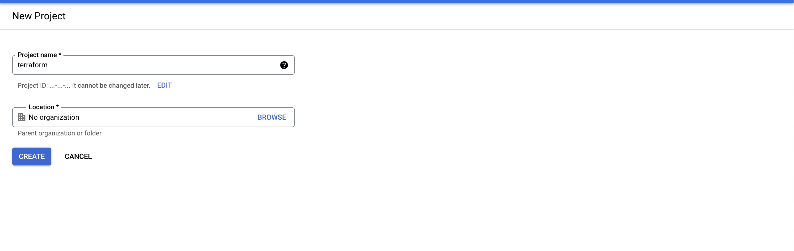
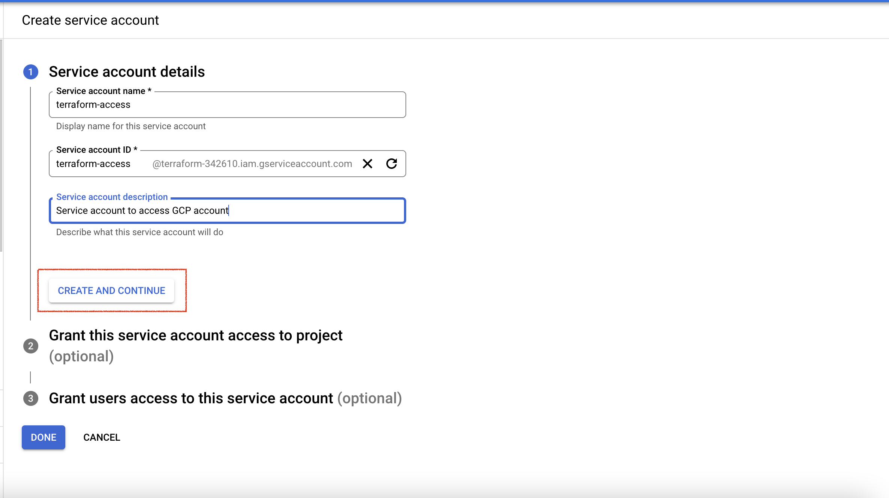
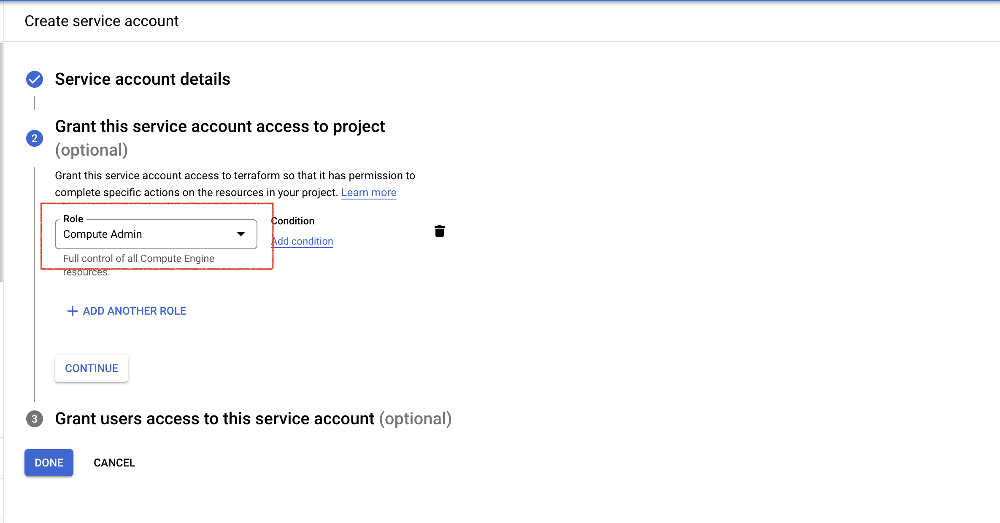
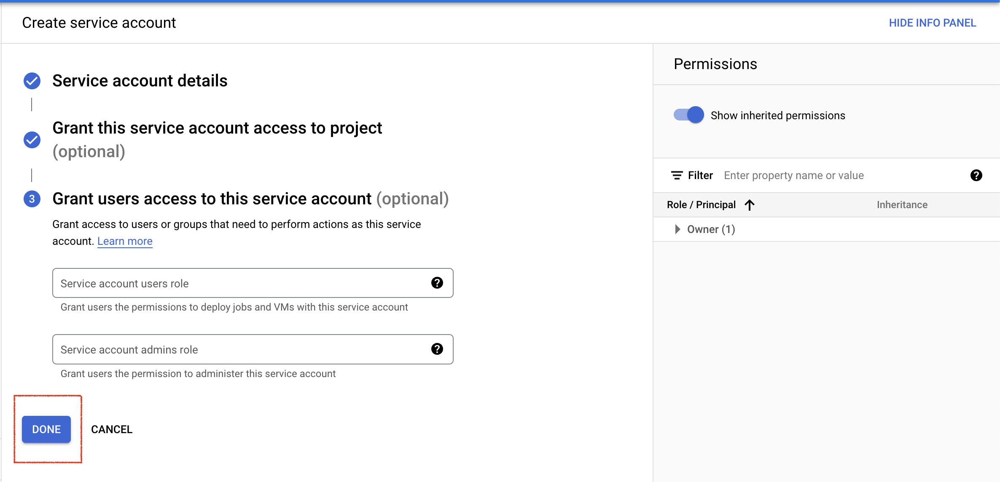
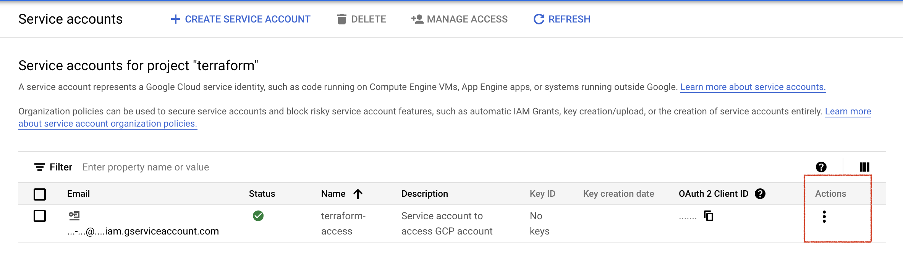

# Load testing with clouds (GCP bombardier)

Today, different sites are under heavy load. This project is aimed at determining the maximum load of your sites

As examples in our project, the most top sites are provided that must cope with any load.

It's not necessary for your project to use these sites in this document (this is just an example in this file - https://github.com/evgmoskalenko/gcp_bombardier/blob/master/user_data/user_data.sh)

## Install terraform

Install Terraform - https://learn.hashicorp.com/tutorials/terraform/install-cli#install-terraform

## GCP Account

Create GCP account - https://cloud.google.com/gcp

## GCP serviceaccount

Configuring Our Service Account on Google Cloud Platform

A service account is a way to give granular access to a vendor or someone else. 
It's really useful when you want to give specific resources to a group or user.

After you create your account on Google Cloud, you should create a service account that will 
access Google Compute Engine (GCE). This is needed to create and handle a virtual machine.

Create a service account and specify the computed admin role. Then, download the 
generated JSON file, rename it `credentials.json`, and save it to your project’s directory (cloned above).
The JSON file you just downloaded should be protected from non-authorized users. This is a private key or
password to manage your infrastructure’s resources. For development purposes, we can add a `.gitignore` 
file to our project, adding `credentials.json` so that it’s not versioned to our repository. 

Open link: [iam-admin/serviceaccounts](https://console.cloud.google.com/projectselector/iam-admin/serviceaccounts?authuser=1&supportedpurview=project)

These steps are shown below:

### Create GCP project for access service account



### Create serviceaccount for access






### Add "Manage Keys" and download `credentials.json`

Click "Actions" -> "Manage Keys" -> "Add Key" -> "Create New Key" with key type JSON and press Create

Now we’re almost able to create a virtual machine instance!

```bash
git clone git@github.com:evgmoskalenko/gcp_bombardier.git
```

Copy your `credentials.json` to the root `gcp_bombardier` directory after clone repo


## Using GCP and Terraform. Let's go

Change your `variables.tf` file settings for bombardment:

* region
* project_id from `credentials.json`
* vm_count
* vm_machine_type - [https://cloud.google.com/compute/docs/machine-types?hl=en](https://cloud.google.com/compute/docs/machine-types?hl=en)

After installing terraform and configuring google cloud account. 
We have to run application using `terraform`, let's go.

There are many arguments in terraform, but this case we just want to run application for first steps.

1. **terraform commands**
* `terraform init`
  This command sets up the environment.

* `terraform apply -auto-approve`
  This command applies configuration defined on terraform files.

* `terraform destroy -auto-approve`
  Against of command above, this remove everything created.
